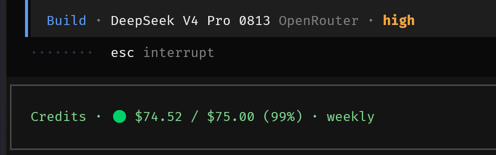
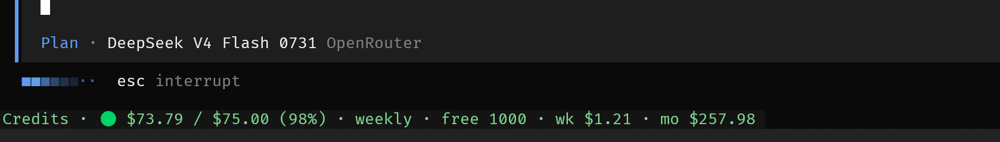

# opencode-openrouter-credits-tui

A persistent [OpenRouter](https://openrouter.ai) credits widget and notifier for [OpenCode](https://opencode.ai/).

Renders a compact, always-visible line into the `app_bottom` slot showing your API credit balance, usage, and reset period. It refreshes automatically, paints instantly from a persisted snapshot, degrades to a muted state on network failure, and notifies you when credits run low.

## Screenshots/Examples

**Widget:**



**Verbose mode:**



## Features

- **Persistent `app_bottom` widget:** visible on every route; append-mode slot, so it coexists with OpenCode's internal footers.
- **15-minute auto-refresh:** auto-updates to keep you informed. No manually checking a command to keep up to date.
- **Instant paint:** the last-known snapshot is seeded before the first network round-trip, and written back after each successful fetch.
- **Low-credit notification:** notifies when remaining balance drops below a configurable threshold.
- **Toast on first fetch / tier change:** visual feedback when the status line changes tier or first loads.
- **Muted failure state:** missing key, API errors, or parse failures degrade to `Credits · ⚠ unavailable`.
- **Configurable:** refresh interval, endpoint, low-credit threshold, and auth file path via plugin options.
- **Widget insights (verbose):** opt-in `verbose` mode adds a days-left estimate, free-model daily requests remaining, and weekly/monthly usage.
- **Secure:** No key is ever hardcoded in the plugin; it is read at runtime and sent only to the configured OpenRouter endpoint as a Bearer token.

## Requirements

- OpenCode (npm plugins are auto-installed by Bun into OpenCode's plugin cache at startup).
- An OpenRouter API key. The plugin reads it from `auth.json` in OpenCode's data dir, which OpenCode itself writes:

| OS      | data dir (`auth.json` lives here)                                                     |
| ------- | ------------------------------------------------------------------------------------- |
| macOS   | `~/.local/share/opencode/auth.json`                                                   |
| Linux   | `~/.local/share/opencode/auth.json` (or `$XDG_DATA_HOME/opencode/auth.json` when set) |
| Windows | `%USERPROFILE%\.local\share\opencode\auth.json`                                       |

> [!NOTE] macOS
> OpenCode uses the same `~/.local/share/opencode` paths on macOS as on Linux — **not** `~/Library/Application Support` (that only applies to admin-managed config at `/Library/Application Support/opencode/`). Finder hides dotfiles — press `Cmd+Shift+.` to reveal `~/.local/…`.

```json
{
	"openrouter": {
		"type": "api",
		"key": "sk-or-v1-..."
	}
}
```

## Install

Add the package to the `plugin` array in your OpenCode config — `~/.config/opencode/opencode.json` on macOS/Linux, `%USERPROFILE%\.config\opencode\opencode.json` on Windows (`.jsonc` files load too; TUI-specific settings go in `tui.json`):

```jsonc
{
	"plugin": ["opencode-openrouter-credits-tui"]
}
```

Restart OpenCode. The widget should now render in the bottom strip of the TUI. Alternatively, install it from the OpenCode CLI: `opencode plugin add opencode-openrouter-credits-tui --global`.

## Where opencode stores files

|                                          | macOS                            | Linux                                             | Windows                                      |
| ---------------------------------------- | -------------------------------- | ------------------------------------------------- | -------------------------------------------- |
| **data dir** (`auth.json`)               | `~/.local/share/opencode`        | `~/.local/share/opencode` (`$XDG_DATA_HOME` wins) | `%USERPROFILE%\.local\share\opencode`        |
| **config** (`opencode.json`, `tui.json`) | `~/.config/opencode`             | `~/.config/opencode` (`$XDG_CONFIG_HOME` wins)    | `%USERPROFILE%\.config\opencode`             |
| **npm plugin cache**                     | `~/.cache/opencode/node_modules` | `~/.cache/opencode/node_modules`                  | `%USERPROFILE%\.cache\opencode\node_modules` |

## Options

Pass options using the tuple form:

```jsonc
{
	"plugin": [
		[
			"opencode-openrouter-credits-tui",
			{
				"refreshIntervalMs": 1800000,
				"lowThreshold": 5,
				"authPath": "/Users/me/opencode/auth.json" // e.g. C:\Users\me\opencode\auth.json on Windows
			}
		]
	]
}
```

| Option              | Type    | Default                                                                       | Description                                                                                                                                                                                                                                                                                            |
| ------------------- | ------- | ----------------------------------------------------------------------------- | ------------------------------------------------------------------------------------------------------------------------------------------------------------------------------------------------------------------------------------------------------------------------------------------------------ |
| `refreshIntervalMs` | number  | `900000` (15 min)                                                             | How often to re-fetch the credits snapshot.                                                                                                                                                                                                                                                            |
| `endpoint`          | string  | `https://openrouter.ai/api/v1/auth/key`                                       | OpenRouter endpoint to query.                                                                                                                                                                                                                                                                          |
| `lowThreshold`      | number  | `10`                                                                          | Remaining balance (in USD) below which a low-credit notification fires. Set to 0 to disable.                                                                                                                                                                                                           |
| `verbose`           | boolean | `false`                                                                       | Show extended info: days-left estimate, free-model requests remaining, and weekly/monthly usage.                                                                                                                                                                                                       |
| `authPath`          | string  | `$XDG_DATA_HOME/opencode/auth.json`, else `~/.local/share/opencode/auth.json` | Absolute path to the `auth.json` holding `openrouter.key`. The default resolves the same on every OS (OpenCode does not use `~/Library` on macOS) — no tilde expansion is performed, so pass an absolute path when overriding (e.g. `/Users/me/opencode/auth.json`, `C:\Users\me\opencode\auth.json`). |

> All monetary values shown by the widget are in USD — OpenRouter reports credit balances in USD.

## Development

```sh
bun install
bun run build           # Bun.build (Solid transform) → dist/
bun run typecheck       # tsc --emitDeclarationOnly
bun test                # unit tests for the pure helpers
npm pack --dry-run      # inspect the publish tarball
```

The source is split so the pure logic is testable without the TUI/Solid runtime:

```
opencode-openrouter-credits-tui/
├── src/
│   ├── index.tsx        # TUI plugin entry: registers the app_bottom widget
│   ├── core.ts          # Core logic: fetch, auth, parse, format, options, theme mapping
│   └── core.test.ts     # bun test unit tests
├── build.ts             # Bundles src/index.tsx with @opentui/solid's transform
├── package.json
├── tsconfig.json
├── README.md
└── LICENSE
```

## License

MIT. See [LICENSE](LICENSE).
